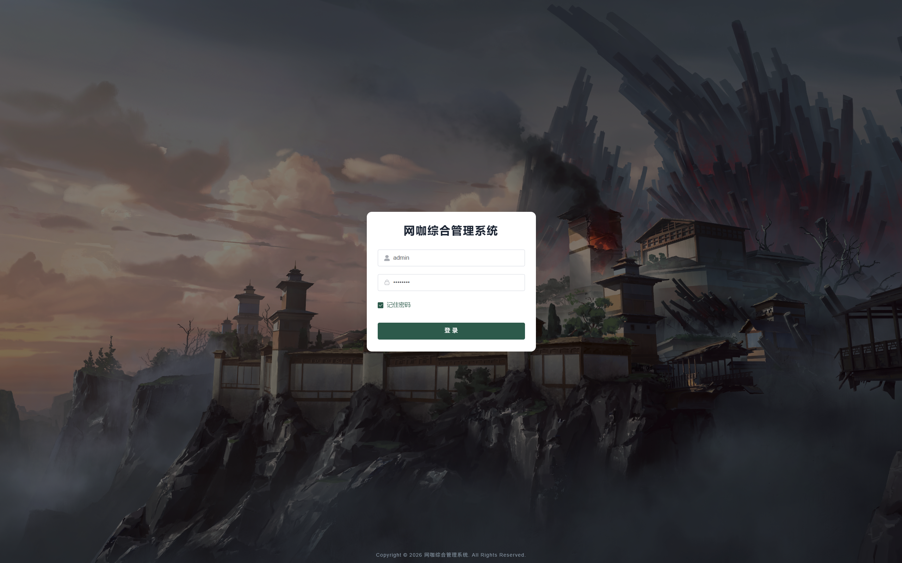
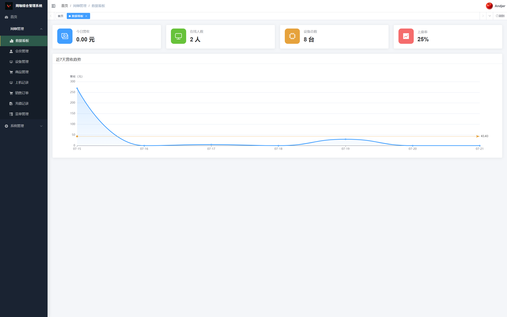
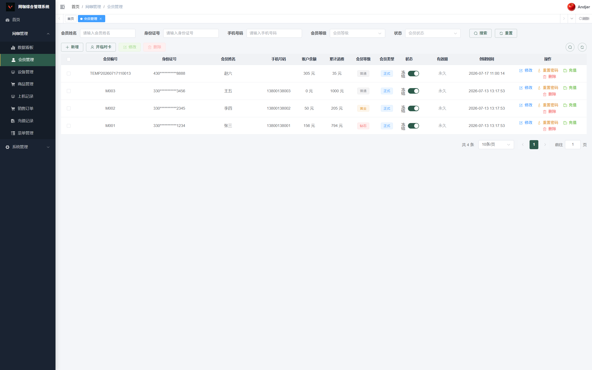
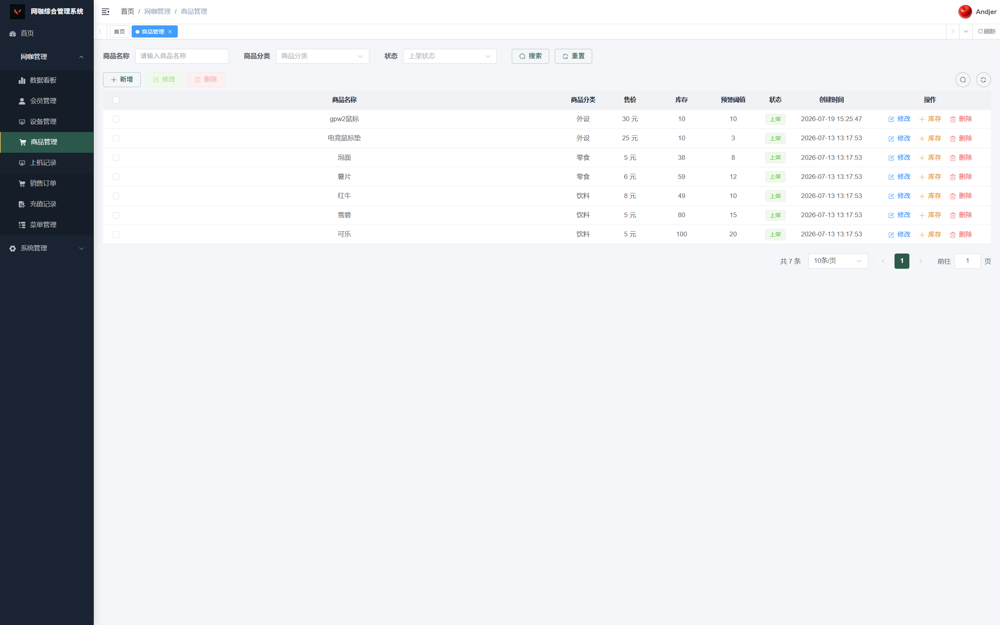
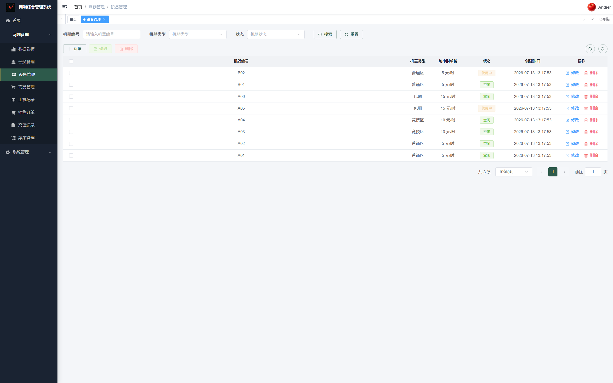

# 网咖综合管理系统

<div align="center">

**基于 RuoYi-Vue3 二次开发 · Maven 多模块 · 前后端分离 · 全流程网咖管理**

[](LICENSE)
[](https://adoptium.net/)
[](https://spring.io/projects/spring-boot)
[](https://vuejs.org/)
[](https://vitejs.dev/)
[](https://element-plus.org/)

</div>

---

## 项目简介

网咖综合管理系统是一套面向网吧/网咖场景的全流程业务管理平台，也是我的**本科毕业设计项目**。系统基于 [RuoYi-Vue3](https://gitee.com/y_project/RuoYi-Vue) 前后端分离框架进行深度二次开发，采用 Maven 多模块架构，覆盖会员管理、设备分区计费、商品销售、上机实时监控、数据统计分析等核心业务场景。

在若依框架基础上，本项目**删减**了代码生成器、定时任务框架、部门管理、岗位管理等无关模块，**新增** `netbar-netcafe` 网咖业务模块，内置心跳保活、余额强制下线、库存防超卖等网咖特有业务逻辑，同时实现了双 Token 隔离认证体系。

## 核心功能

| 模块 | 说明 |
|------|------|
| 👥 会员管理 | 正式会员注册 / 临时卡开户（24h 自动过期），身份证后 6 位即登录密码 |
| 🖥️ 设备管理 | 分区配置（普通区 / 竞技区 / 包厢），机位状态实时监控与释放 |
| ⏱️ 分段计费 | <15 分钟免单，15–30 分钟按半小时计价，≥30 分钟整小时向上取整 |
| 💓 心跳保活 | 会员端每 15 秒上报心跳，后端 60 秒无心跳自动结账释放机位 |
| 🛑 强制下线 | 余额归零 5 分钟后自动结账，防止恶意占座 |
| 🛒 商品销售 | 购物车模式 + 余额支付，SQL 层 `WHERE stock >= quantity` 防超卖 |
| 💰 充值管理 | 充值记录与余额变动流水追踪 |
| 📊 数据看板 | ECharts 近 7 天网费收入 / 新增会员 / 商品销量趋势图 |
| 🔐 双 Token 隔离 | 后台管理 `Authorization`（JWT + Redis），会员端 `Member-Token`（JWT 24h 不存 Redis） |
## 技术栈

> 完整技术栈清单详见 [TECH_STACK.md](TECH_STACK.md)

### 后端

| 技术 | 版本 | 用途 |
|------|------|------|
| JDK | 21 | Java 运行环境 |
| Spring Boot | 4.0.6 | 核心应用框架 |
| Spring Security | — | 认证与权限控制 |
| JWT | jjwt 0.9.1 | 无状态 Token 签发与校验 |
| MyBatis | 4.0.1 | ORM 持久层 |
| PageHelper | 4.1.0 | 物理分页 |
| MySQL | 9.7 | 关系型数据库 |
| Redis | 5.0 | 缓存 / Token 黑名单 |
| Druid | 1.2.28 | 数据库连接池与 SQL 监控 |
| SpringDoc | 3.0.3 | OpenAPI 3 / Swagger UI 文档 |

### 前端

| 技术 | 版本 | 用途 |
|------|------|------|
| Vue 3 | 3.5.26 | 渐进式 JavaScript 框架 |
| Vite | 6.4.1 | 极速构建工具 |
| Element Plus | 2.13.1 | 桌面端 UI 组件库 |
| Pinia | 3.0.4 | 轻量级状态管理 |
| Vue Router | 4.6.4 | SPA 路由 |
| ECharts | 5.6.0 | 数据可视化图表 |
| Axios | 1.13.2 | HTTP 请求客户端 |
| @vueuse/core | 14.1.0 | Vue Composition 工具集 |

## 项目结构

```
NetBarSystem/
├── netbar-backend/                          # 后端 Maven 多模块工程
│   ├── netbar-admin/                        # 🔧 启动入口 + REST Controller 层
│   ├── netbar-common/                       # 📦 公共工具、实体基类、Excel/注解
│   ├── netbar-framework/                    # 🔒 Security / JWT / AOP 切面 / 限流
│   ├── netbar-module-system/                # ⚙️ 系统业务（用户·角色·菜单·字典）
│   └── netbar-netcafe/                      # 🔥 网咖核心业务模块
│       ├── domain/                          #   会员/设备/商品/订单 实体类
│       ├── mapper/                          #   MyBatis 映射接口 + XML
│       ├── service/                         #   业务逻辑 + 防超卖 / 分段计费
│       ├── task/                            #   心跳超时 + 强制下线 定时任务
│       └── util/                            #   会员 JWT 工具类
├── src/                                     # 前端 Vue 3 项目
│   ├── api/                                 #   接口请求（后台 + 会员端）
│   ├── views/netcafe/                       #   后台管理页面（会员·设备·商品·上机·订单）
│   ├── views/member/                        #   会员自助端（登录·仪表盘·购物）
│   ├── layout/                              #   布局组件（侧边栏·导航栏·Logo）
│   ├── store/                               #   Pinia 状态管理
│   ├── router/                              #   路由配置 + 权限守卫
│   └── assets/styles/                       #   全局样式
├── netbar-backend/sql/                      # 数据库初始化脚本
├── TECH_STACK.md                            # 完整技术栈清单
├── DEPLOY.md                                # 本地部署指南
└── CLAUDE.md                                # AI 辅助开发说明
```

## 页面截图

> 请将项目运行截图放入 `screenshots/` 目录，然后在此处取消注释并引用。

```markdown
<!-- 登录页 -->


<!-- 后台首页数据看板 -->


<!-- 会员管理 -->


<!-- 会员端界面 -->


<!-- 商品销售 -->


<!-- 设备管理 -->


<!-- 上机记录 -->
<!--  -->
```

## 环境准备

| 软件 | 版本要求 | 说明 |
|------|----------|------|
| JDK | 21+ | 推荐 [Adoptium](https://adoptium.net/) |
| Maven | 3.9+ | 后端依赖管理与构建 |
| MySQL | 8.0+（推荐 9.7） | 数据库服务 |
| Redis | 5.0+ | 缓存与 Token 管理 |
| Node.js | v24+ | 前端运行时 |
| pnpm / npm | — | 前端包管理器 |

## 后端启动

### 1. 数据库初始化

```sql
CREATE DATABASE IF NOT EXISTS `ry-vue`
  DEFAULT CHARACTER SET utf8mb4
  DEFAULT COLLATE utf8mb4_general_ci;
```

执行 `netbar-backend/sql/` 目录下的 SQL 脚本导入表结构与初始数据。

### 2. 配置文件

```bash
cd netbar-backend/netbar-admin/src/main/resources/

# 复制 Druid 数据源配置模板
cp application-druid-example.yml application-druid.yml

# 编辑 application-druid.yml，填入本地数据库连接信息
```

> ⚠️ `application-druid.yml`、`application-dev.yml`、`application-prod.yml` 已加入 `.gitignore`，请妥善保管本地配置，**勿将含真实密码的文件提交到仓库**。

### 3. 启动 Redis

```bash
# Windows
redis-server.exe

# macOS
redis-server

# Linux
sudo systemctl start redis
```

### 4. 编译运行

```bash
cd netbar-backend

# 首次编译
mvn clean package -DskipTests

# 启动
java -jar netbar-admin/target/netbar-admin.jar
```

启动成功后访问：

| 地址 | 说明 |
|------|------|
| http://localhost:8080/swagger-ui.html | Swagger API 文档 |
| http://localhost:8080/druid | Druid 数据库监控 |

## 前端启动

### 1. 安装依赖

```bash
cd NetBarSystem

npm install
# 或 pnpm install
```

### 2. 配置环境变量

复制 `.env.example` 为 `.env.development`：

```env
VITE_APP_TITLE = 网咖综合管理系统
VITE_APP_ENV = 'development'
VITE_APP_BASE_API = '/dev-api'
```

### 3. 启动开发服务器

```bash
npm run dev
```

浏览器访问 `http://localhost:8088`。

### 4. 默认账号

| 入口 | URL | 账号 | 密码 |
|------|------|------|------|
| 后台管理 | http://localhost:8088 | admin | admin123 |
| 会员端 | http://localhost:8088/member | M001 | 011234 |

## 注意事项

1. **配置文件安全**：`application-druid.yml`、`application-dev.yml`、`application-prod.yml`、`.env.development`、`.env.production` 等含本地敏感信息的文件已加入 `.gitignore`。使用前请复制对应的 `*-example.*` 模板文件并填入本地配置。
2. **Redis 强依赖**：后端启动依赖 Redis，验证码缓存、Token 黑名单等功能均需 Redis 正常运行。
3. **数据库初始化**：首次启动前必须导入 `netbar-backend/sql/` 下的 SQL 脚本。
4. **端口冲突**：后端默认 `8080`，前端默认 `8088`，启动前请确认端口未被占用。
5. **Windows 兼容**：路径中的反斜杠请统一替换为 `/`；如遇 LF/CRLF 换行警告，可配置 `git config core.autocrlf true`。

## 许可证

本项目基于 [RuoYi-Vue3](https://gitee.com/y_project/RuoYi-Vue) 二次开发，采用 [MIT](https://opensource.org/licenses/MIT) 开源协议。

> 💡 请在仓库根目录创建 `LICENSE` 文件以确保顶部许可证徽章可正常跳转。

## 联系方式

- **Issues**：如有问题或建议，欢迎提交 [GitHub Issues](https://github.com/AndjerOvO/netbar-management-system/issues)
- **PR**：欢迎提交 Pull Request

---

<div align="center">

**⭐ 如果这个项目对你有帮助，请给一个 Star！**

</div>
